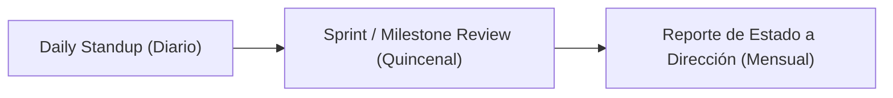

# [PRO-GP-02] Monitoreo y Control del Proyecto

| Campo | Detalle |
|---|---|
| **Código** | PRO-GP-02 |
| **Versión** | 1.0 |
| **Área CMMI** | Project Monitoring and Control (PMC) |
| **Responsable** | Project Managers |

---

## 1. Propósito
Proveer comprensión del progreso del proyecto para tomar acciones correctivas oportunas cuando el desempeño se desvíe significativamente de la línea base planificada.

## 2. Puntos de Control y Ritmo Operativo

- **Daily Standup (15 min)**: Revisión de avance diario, compromisos del día e impedimentos bloqueantes.
- **Sprint / Milestone Review**: Comparativa de entregables completados vs. planificados.
- **Reporte de Estado (Status Report)**: Resumen ejecutivo de horas consumidas, hitos cumplidos y desvíos para clientes y dirección.

## 3. Manejo de Desvíos y Acciones Correctivas
Cuando el desvío en tiempo o presupuesto supera el **10%** respecto a la línea base:
1. El PM convoca una reunión de análisis de causa raíz con el Tech Lead.
2. Se documenta una **Acción Correctiva** en el tablero de seguimiento.
3. Si el alcance requiere ajuste, se procesa una Solicitud de Cambio (*Change Request* formal).
