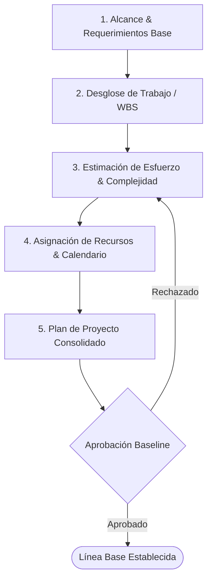

# [PRO-GP-01] Planificación y Estimación de Proyectos

| Campo | Detalle |
|---|---|
| **Código** | PRO-GP-01 |
| **Versión** | 1.0 |
| **Área CMMI** | Project Planning (PP) |
| **Responsable** | Project Managers / Scrum Masters |

---

## 1. Propósito
Establecer y mantener planes que definan las actividades, recursos, dependencias y compromisos del proyecto, garantizando una estimación realista del esfuerzo, cronograma y costos.

## 2. Alcance
Aplica al inicio de cualquier nuevo proyecto o fase evolutiva gestionada desde la oficina de Querétaro.

## 3. Matriz RACI

| Actividad | PM | Tech Lead | Equipo Dev | QA Lead | Stakeholders |
|---|:---:|:---:|:---:|:---:|:---:|
| Definición de WBS / Historias de Usuario | A | R | C | C | I |
| Estimación de Esfuerzo (Planning Poker / T-Shirt) | I | A | R | R | - |
| Elaboración del Cronograma y Plan de Hitos | R / A | C | I | I | C |
| Aprobación formal de compromisos | A | C | - | - | R |

---

## 4. Flujo del Proceso

## 5. Entregables Obligatorios
1. **Plan de Proyecto (Project Management Plan)**: Fechas clave, hitos y supuestos.
2. **Matriz de Estimaciones**: Documento con la base de cálculo de horas/puntos de historia.
3. **Línea Base de Calendario**: Fechas de entrega comprometidas con el cliente.
