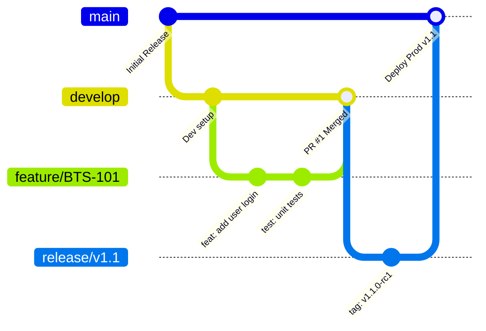

# [PRO-IS-02] Diseño Técnico y Construcción de Software

| Campo | Detalle |
|---|---|
| **Código** | PRO-IS-02 |
| **Versión** | 1.0 |
| **Área CMMI** | Technical Solution (TS) |
| **Responsable** | Tech Leads & Desarrolladores |

---

## 1. Propósito
Garantizar que el diseño arquitectónico y la escritura de código cumplan con estándares técnicos de robustez, mantenibilidad, seguridad y alineación con los requerimientos aprobados.

## 2. Flujo de Trabajo en Git (GitFlow Simplificado)

### Reglas de Nomenclatura de Ramas:
- **Features**: `feature/[JIRA-KEY]-descripcion-corta`
- **Bugs**: `bugfix/[JIRA-KEY]-descripcion-corta`
- **Hotfixes**: `hotfix/[JIRA-KEY]-fix-inmediato`

---

## 3. Estándar de Pull Requests (PR) y Code Review

Para poder integrar código a `develop` o `main`:
1. **Mínimo 1 aprobación** de un Senior / Tech Lead.
2. **Pipelines de CI en verde**: Linters, pruebas unitarias y análisis estático (SonarQube/GitHub Actions).
3. **Sin comentarios bloqueantes abiertos**.
4. **Convención de Commits**: Uso de Conventional Commits (`feat:`, `fix:`, `refactor:`, `docs:`, `test:`).
