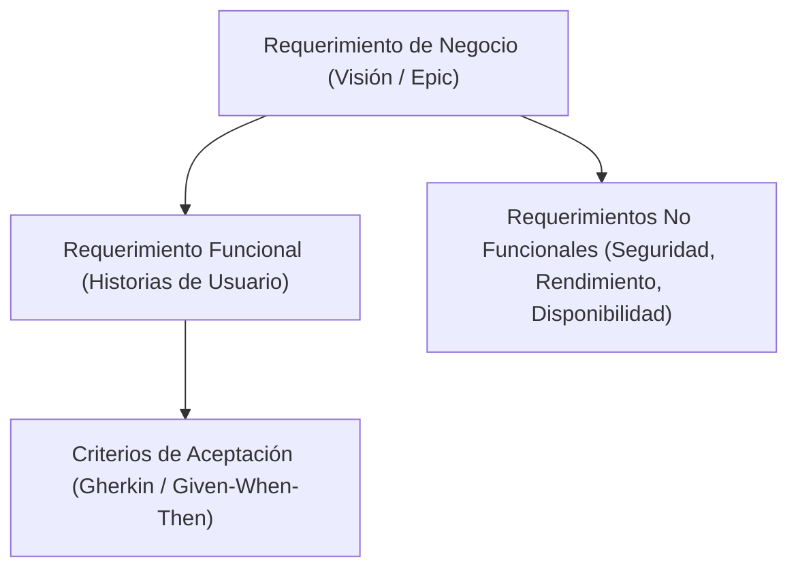

# [PRO-IS-01] Gestión y Desarrollo de Requerimientos

| Campo | Detalle |
|---|---|
| **Código** | PRO-IS-01 |
| **Versión** | 1.0 |
| **Área CMMI** | Requirements Management (REQM) & Requirements Development (RD) |
| **Responsable** | Product Owner / Tech Lead / Analista Funcional |

---

## 1. Propósito
Identificar, analizar y consensuar las necesidades de los clientes y usuarios finales para transformarlas en requerimientos claros, verificables y con trazabilidad hacia el diseño, código y casos de prueba.

## 2. Niveles de Requerimiento

## 3. Matriz de Trazabilidad
Cada requerimiento debe contar con un identificador único en Jira:
- **ID de Requerimiento** $\leftrightarrow$ **Branch de Git / PR** $\leftrightarrow$ **ID de Caso de Prueba en TestRail/Zephyr**.

:::important Criterios de Aceptación Obligatorios
Ningún requerimiento pasa al estado **Ready for Dev** sin:
1. Criterios de aceptación explícitos y consensuados con el cliente/PO.
2. Identificación de dependencias con APIs o servicios externos.
3. Estimación revisada por el equipo de ingeniería.
:::
