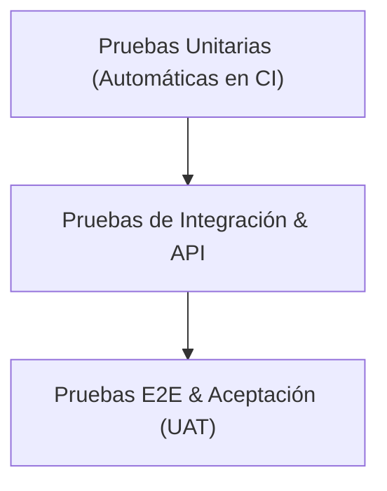

# [PRO-IS-03] Aseguramiento y Pruebas de Calidad (QA)

| Campo | Detalle |
|---|---|
| **Código** | PRO-IS-03 |
| **Versión** | 1.0 |
| **Área CMMI** | Verification (VER) & Validation (VAL) |
| **Responsable** | QA Lead / QA Engineers |

---

## 1. Propósito
Verificar que los productos de trabajo cumplan con las especificaciones técnicas especificadas (*¿Estamos construyendo el producto correctamente?*) y validar que satisfagan el uso previsto por el cliente (*¿Estamos construyendo el producto correcto?*).

## 2. Niveles de Prueba

- **Pruebas Unitarias**: Responsabilidad del desarrollador (cobertura objetivo $\ge 75\%$).
- **Pruebas de Integración y API**: Ejecución de suites con Postman / Cypress / Playwright.
- **Pruebas Funcionales y Regresión**: Verificación de casos de prueba antes de cada release.
- **UAT (User Acceptance Testing)**: Validación con el cliente en ambiente de Staging.

## 3. Severidad de Defectos (Bugs)
- **Crítico (P1)**: Caída de servicio o bloqueo total sin alternativa.
- **Mayor (P2)**: Falla funcional grave con alternativa compleja.
- **Medio (P3)**: Falla funcional menor que no impide la operación principal.
- **Menor (P4)**: Detalles cosméticos, textos o mejoras de UX menores.
