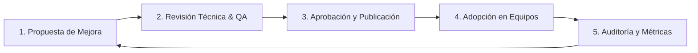

# Introducción al Marco CMMI

En la oficina de Querétaro adoptamos las mejores prácticas del modelo **CMMI** (*Capability Maturity Model Integration*) para asegurar que nuestros proyectos de software y consultoría se ejecuten de manera predecible, con alta calidad y con enfoque en la mejora continua.

---

## 🎯 Objetivos de la Adopción CMMI

- **Consistencia**: Asegurar que diferentes equipos utilicen criterios homogéneos para estimar, desarrollar, probar y desplegar software.
- **Trazabilidad**: Contar con evidencia y registros claros desde el requerimiento inicial del cliente hasta la entrega final en producción.
- **Reducción de Riesgos**: Detectar desvíos de tiempo, costo o calidad en etapas tempranas.
- **Cultura de Calidad**: Pasar de "apagar fuegos" a procesos gestionados y medibles.

---

## 📊 Niveles de Madurez CMMI

El modelo CMMI define niveles evolutivos para evaluar la capacidad de una organización:

| Nivel | Nombre | Descripción resumida |
|---|---|---|
| **1** | **Inicial** | Procesos impredecibles, poco controlados y reactivos. |
| **2** | **Gestionado** | Los proyectos se planifican, ejecutan, miden y controlan a nivel proyecto. |
| **3** | **Definido** | Procesos estandarizados en toda la organización; activos de proceso compartidos. |
| **4** | **Gestionado Cuantitativamente** | Procesos controlados con técnicas estadísticas y cuantitativas. |
| **5** | **Optimización** | Enfoque en la mejora continua e innovación de procesos. |

> **Meta Querétaro**: Consolidar y sostener las prácticas correspondientes a **Nivel 2 y Nivel 3**, asegurando que todos los miembros del equipo conozcan y apliquen los activos de proceso organizacionales.

---

## 🧩 Categorías de Procesos en Nuestro Hub

Hemos organizado nuestros procesos en tres grupos principales:

1. **[Gestión de Proyectos (Project Management)](./01-gestion-proyectos/planificacion.md)**:
   - Planificación del Proyecto (PP)
   - Monitoreo y Control del Proyecto (PMC)
   - Gestión de Riesgos (RSKM)

2. **[Ingeniería de Software (Engineering)](./02-ingenieria-desarrollo/gestion-requerimientos.md)**:
   - Desarrollo y Gestión de Requerimientos (RD / REQM)
   - Solución Técnica, Arquitectura y Código (TS)
   - Verificación y Validación / QA (VER / VAL)

3. **[Soporte y Calidad (Support & Quality)](./03-soporte-calidad/gestion-configuracion.md)**:
   - Gestión de Configuración (CM)
   - Aseguramiento de Calidad de Procesos y Productos (PPQA)
   - Medición y Análisis / Métricas (MA)

---

## 📝 Ciclo de Vida de un Proceso

Cada proceso documentado en esta guía pasa por el siguiente ciclo:

