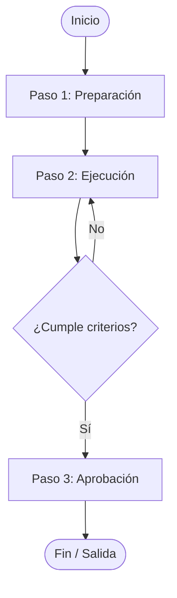

# Plantilla Estándar de Proceso CMMI

Utiliza esta plantilla Markdown como base para documentar o estandarizar cualquier nuevo proceso o procedimiento de la oficina.

:::info Instrucciones
Copia la estructura de abajo al crear un archivo `.md` dentro de la subcarpeta correspondiente en `docs/cmmi/`.
:::

```markdown
---
title: [Código-PRO] Nombre del Proceso
---

# [Código-PRO] Nombre del Proceso

| Campo | Detalle |
|---|---|
| **Código** | PRO-XXX-01 |
| **Versión** | 1.0 |
| **Área CMMI** | [Ej: Project Planning (PP) / Technical Solution (TS)] |
| **Responsable / Dueño** | [Rol o persona dueña del proceso] |
| **Última Revisión** | YYYY-MM-DD |

---

## 1. Propósito
Define de forma concisa qué problema resuelve este proceso y qué beneficio aporta a la organización o proyecto.

## 2. Alcance
Especifica a qué proyectos, tecnologías o áreas de la oficina aplica este proceso y qué escenarios quedan expresamente excluidos.

## 3. Matriz de Roles y Responsabilidades (RACI)
- **R (Responsible)**: Quien ejecuta la tarea.
- **A (Accountable)**: Quien aprueba y rinde cuentas.
- **C (Consulted)**: A quien se consulta por su experiencia técnica.
- **I (Informed)**: A quien se le comunica el resultado.

| Actividad | Project Manager | Tech Lead | Desarrollador | QA Engineer | Cliente |
|---|:---:|:---:|:---:|:---:|:---:|
| Definición inicial | A | R | C | I | C |
| Ejecución técnica | I | A | R | C | - |
| Validación y entrega| A | C | I | R | I |

---

## 4. Entradas (Inputs)
Lista de elementos, datos o documentos necesarios para que el proceso pueda iniciar:
- [ ] Documento de requerimientos o Ticket Jira.
- [ ] Criterios de aceptación definidos.
- [ ] Acceso a los repositorios y entornos correspondientes.

---

## 5. Procedimiento / Flujo de Actividades



### Paso 1: [Nombre de la actividad]
- **Descripción**: Detalle de lo que se debe realizar.
- **Herramienta**: Jira, GitHub, Figma, etc.
- **Responsable**: [Rol]

### Paso 2: [Nombre de la actividad]
- **Descripción**: ...

---

## 6. Salidas y Entregables (Outputs)
Artefactos tangibles generados al completar el proceso:
- Código integrado en rama principal con PR aprobado.
- Reporte de pruebas o evidencia de ejecución.
- Registro actualizado en herramienta de gestión (Jira/Confluence).

---

## 7. Métricas e Indicadores
Forma en que se mide la efectividad del proceso:
- **Tasa de defectos post-entrega**: Número de bugs reportados tras el paso a producción.
- **Tiempo de ciclo (Lead Time)**: Días promedio desde inicio hasta entrega final.
- **Cumplimiento de estimación**: Horas reales vs. horas estimadas.

---

## 8. Formatos, Plantillas y Enlaces de Referencia
- [Plantilla de Plan de Proyecto (Google Docs/Drive)]
- [Checklist de Validación antes de Release]
- [Guía de Estilos de Código]
```
