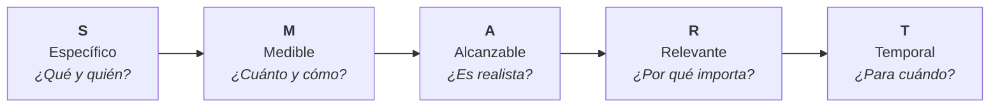

# G01 - Guía para la Definición de Objetivos SMART

Esta guía orienta a los miembros del equipo en la correcta formulación de objetivos individuales, de proyecto y departamentales, utilizando la metodología **SMART** para asegurar claridad, alineación y resultados tangibles.

---

## 🎯 Objetivos de la Guía

- Orientar a los integrantes del equipo en la formulación de objetivos eficaces y accionables.
- Proporcionar un marco común de evaluación para saber si un objetivo está correctamente planteado.
- Facilitar el seguimiento de metas en proyectos, planes de mejora continua (CMMI) y evaluaciones de desempeño.

## 📋 Prerrequisitos

- Identificar una necesidad de negocio, técnica o de proceso que requiera ser atendida.
- Conocer el contexto del proyecto o área de la oficina donde impactará el objetivo.

---

## 💡 ¿Qué es un objetivo SMART?

El concepto fue introducido en 1981 por George T. Doran en su publicación *"There’s a S.M.A.R.T. way to write management’s goals and objectives"*. Su propósito es sustituir metas vagas o subjetivas por declaraciones claras y comprobables.



Un objetivo **SMART** cumple con cinco atributos esenciales:

1. **S - Specific (Específico)**: Claro, detallado y sin ambigüedades.
2. **M - Measurable (Medible)**: Con métricas o indicadores numéricos cuantificables.
3. **A - Achievable (Alcanzable)**: Retador pero realista según los recursos y capacidades disponibles.
4. **R - Relevant (Relevante)**: Alineado a las prioridades estratégicas del proyecto u oficina.
5. **T - Time-bound (Temporal)**: Con una fecha de inicio y una fecha límite (*deadline*) explícita.

---

## 🔍 Desglose de los 5 Criterios SMART

### 1. Específico (Specific)
Un objetivo nunca debe dejar lugar a interpretaciones libres. Para lograr especificidad, responde:
- **¿Qué queremos lograr exactamente?** Acción concreta y resultado esperado.
- **¿Quiénes participan?** Roles, equipos o personas responsables y colaboradoras.
- **¿Dónde o en qué alcance?** Módulo, proyecto, proceso o área afectada.

:::tip Criterio de Especificidad
Si dos personas leen el objetivo y visualizan un resultado diferente, el objetivo **no** es lo suficientemente específico.
:::

---

### 2. Medible (Measurable)
Si no se puede medir, no se puede gestionar ni evaluar su éxito. Debe existir evidencia numérica o verificación binaria clara. Responde:
- **¿Cuál es la métrica de partida (línea base) y cuál es la meta esperada?** (Ej. De un 60% a un 85%).
- **¿A través de qué fuente o herramienta se comprobará?** (Reportes de Jira, métricas de SonarQube, Google Analytics, horas registradas).
- **¿Cómo sabremos fehacientemente que se cumplió?**

---

### 3. Alcanzable (Achievable)
Fijar metas imposibles genera frustración y desmotivación en el equipo. Por otro lado, metas demasiado fáciles no impulsan el crecimiento. Responde:
- **¿Contamos con los conocimientos, herramientas, equipo y tiempo necesarios?**
- **¿Identificamos los riesgos o bloqueos potenciales que podrían impedir lograrlo?**
- **¿El esfuerzo estimado es compatible con el resto de la carga de trabajo?**

---

### 4. Relevante (Relevant)
El objetivo debe tener un impacto real en la misión del equipo o de la organización. Evita el "trabajar por trabajar". Responde:
- **¿Por qué vale la pena invertir tiempo y esfuerzo en esto ahora?**
- **¿Contribuye a los objetivos estratégicos de la oficina, del cliente o de CMMI?**
- **¿Resuelve un problema real o genera valor directo perceptible?**

---

### 5. Temporal (Time-bound)
Un objetivo sin límite de tiempo se convierte en una intención perpetua sujeta a procrastinación. Responde:
- **¿Cuál es la fecha límite exacta de entrega o evaluación?** (Día/Mes/Año o cierre de Q/Sprint específico).
- **¿Existen hitos intermedios para monitorear el progreso antes de la fecha final?**

---

## 📐 Fórmula Práctica para Redactar un Objetivo SMART

Para simplificar la redacción, utiliza la siguiente estructura sintáctica:

:::info Estructura General de la Fórmula
**Verbo en infinitivo** + **Métrica de cambio (de X a Y)** + **Contexto / Medio** + **Fecha límite**
:::

```text
[Verbo de acción en infinitivo]
  + [Qué se medirá y cuál es la meta numérica (De X a Y)]
  + [A través de qué medio, estrategia o ámbito]
  + [Para qué fecha o período límite]
```

---

## ⚖️ Ejemplos Prácticos: Antes vs. Después

### Ejemplo 1: Calidad e Ingeniería de Software
* ❌ **Mal planteado (Vago)**: *"Mejorar la calidad de las entregas y tener menos errores en el proyecto."*
* ✅ **SMART**: *"Reducir los defectos reportados en pruebas de QA en un 30% (de un promedio de 10 a menos de 7 bugs por sprint) en el sistema de pagos mediante la adopción de revisiones de código obligatorias y pruebas unitarias con cobertura mínima del 75%, antes del 30 de noviembre de 2026."*

### Ejemplo 2: Gestión de Procesos CMMI
* ❌ **Mal planteado (Vago)**: *"Documentar los procesos de la oficina."*
* ✅ **SMART**: *"Estandarizar y publicar en el portal de documentación el 100% de los 5 procesos clave del área de Ingeniería bajo la plantilla CMMI para el cierre del Q4 2026."*

### Ejemplo 3: Operaciones e Integración de Oficina
* ❌ **Mal planteado (Vago)**: *"Hacer que el onboarding sea más rápido."*
* ✅ **SMART**: *"Disminuir el tiempo de integración técnica (time-to-first-commit) de nuevos ingresos de 8 días hábiles a 3 días hábiles para el 15 de diciembre de 2026, implementando el checklist automatizado y la guía de bienvenida local."*

---

## ⚠️ Errores Frecuentes al Formular Objetivos

| Error Común | Por qué ocurre | Cómo corregirlo |
|---|---|---|
| **Confundir objetivo con tarea** | Escribir una actividad en lugar de su resultado (ej: *"Instalar SonarQube"*). | Enfócate en el beneficio (ej: *"Asegurar cobertura de pruebas ≥ 80% mediante SonarQube"*). |
| **Falta de línea base** | Decir *"incrementar"* sin saber de dónde se parte. | Medir la situación actual antes de fijar la cifra meta. |
| **Fechas abstractas** | Usar frases como *"lo antes posible"* o *"en los próximos meses"*. | Definir fechas concretas (ej. *"al 15 de diciembre"*). |
| **Métricas de vanidad** | Medir cosas que no impactan en el valor real. | Preguntarse *"¿Si logramos este número, el negocio o proyecto realmente mejora?"*. |

---

## ✅ Checklist de Autoevaluación

Antes de dar por formalizado tu objetivo, verifica si cumple con todos los puntos:

- [ ] ¿El objetivo comienza con un verbo de acción en infinitivo?
- [ ] ¿Cualquier integrante del equipo entiende exactamente qué se debe lograr sin necesidad de explicación adicional?
- [ ] ¿Incluye un número, porcentaje o indicador verificable?
- [ ] ¿Es viable alcanzarlo con los recursos actuales sin poner en riesgo la operación?
- [ ] ¿Está claro por qué este objetivo es prioritario en este momento?
- [ ] ¿Tiene un día o período de entrega límite explícito?

---

## 👥 Control del Documento e Historial

### Adaptación y Mejora Continua (BTS Querétaro)
- **José Carlos Pasillas**

### Bitácora de Versiones

| Versión | Fecha | Cambios Principales |
|:---:|:---:|---|
| **1.0** | 2026-10 | Modernización para **BTS Querétaro**: integración de fórmula de redacción, tabla comparativa Antes vs. Después, checklist de autoevaluación, diagramas Mermaid y corrección de redacción. |

