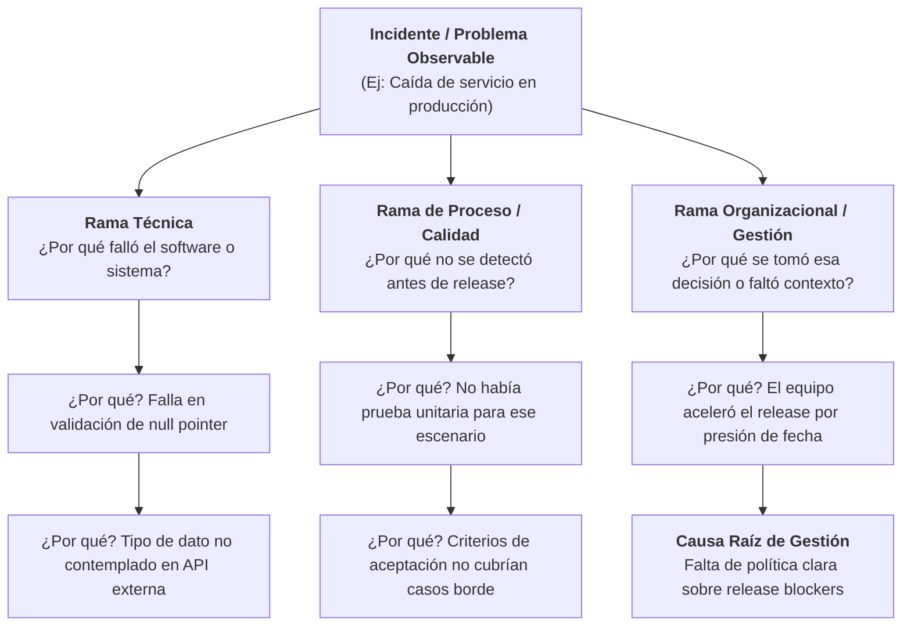
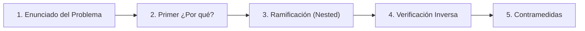

# G02 - Guía de Análisis de Causa Raíz: Los 5 Porqués (Nested Whys)

Esta guía establece el método para investigar incidentes, defectos en software y desviaciones operativas en la oficina, yendo más allá de los síntomas superficiales mediante la técnica de los **5 Porqués** (*5 Whys*) y su variante ramificada **Porqués Anidados** (*Nested Whys*).

---

## 🎯 Objetivos de la Guía

- Proveer un método estructurado y libre de culpas (*blameless*) para identificar la causa raíz de fallas e incidentes.
- Diferenciar entre soluciones superficiales (parches inmediatos) y **contramedidas sistémicas** que eviten la recurrencia.
- Enseñar a utilizar la estructura de **Porqués Anidados** para problemas complejos donde confluyen causas técnicas, de proceso y de gestión.

## 📋 Prerrequisitos

- Un problema o incidente claramente identificado (ej. bug en producción, desvío de cronograma, falla en pipeline de CI/CD).
- Evidencia objetiva del suceso (logs, reportes de Jira, métricas, grabaciones o capturas).

---

## 🏛️ Origen Histórico: Sakichi Toyoda y el Sistema Toyota

La técnica de los **5 Porqués** fue concebida en la década de 1930 por **Sakichi Toyoda** (inventor industrial y fundador de Toyota Industries) y más tarde formalizada por **Taiichi Ohno** como uno de los pilares del *Toyota Production System (TPS)* y la filosofía Lean.

> *"La base del enfoque científico de Toyota es preguntarse cinco veces '¿por qué?' ante cualquier problema. Al repetir por qué cinco veces, la naturaleza del problema y su solución se vuelven evidentes."*  
> — **Taiichi Ohno**, *Toyota Production System: Beyond Large-Scale Production*

---

## 🌳 De los 5 Porqués Lineales a los "Nested Whys" (Porqués Anidados)

En entornos de ingeniería de software y operaciones modernas, los problemas rara vez se deben a una única causa lineal. Casi siempre interactúan tres dimensiones:

Un análisis de **Porqués Anidados (*Nested Whys*)** abre ramas independientes cuando una respuesta revela más de un factor causal contribuyente.

---

## 🚀 Metodología Paso a Paso

### Paso 1: Redactar el Enunciado del Problema con Hechos
- Describe **qué pasó**, **cuándo**, **dónde** y su **impacto cuantificable**.
- ❌ *Mal*: "Los desarrolladores subieron código con errores."
- ✅ *Bien*: "El servicio de autenticación rechazó el 40% de las solicitudes de inicio de sesión durante 35 minutos tras el despliegue de la versión 2.4.1."

### Paso 2: Preguntar el primer "¿Por qué?" basado en evidencia
- Cada respuesta debe estar respaldada por datos observables (logs, métricas, código), nunca por suposiciones o culpas personales.

### Paso 3: Profundizar y Anidar Ramas
- Si la respuesta involucra tanto un fallo en la herramienta como una omisión en el proceso, abre dos ramas:
  - **Dimensión Técnica**: ¿Por qué el código/infraestructura permitió el fallo?
  - **Dimensión de Detección/Proceso**: ¿Por qué los filtros previos (code review, pruebas automatizadas, QA) no lo atraparon?
  - **Dimensión de Decisión/Capacitación**: ¿Qué conocimiento o acuerdo faltaba?

### Paso 4: La Prueba de la Verificación Inversa (*Reverse Test*)
Para validar la lógica de tu cadena de porqués, lee tu análisis en sentido inverso usando la palabra **"Por lo tanto"**:
> *"No había política de release blockers, **por lo tanto** se apresuró el despliegue; como se apresuró, se omitieron casos borde, **por lo tanto** no hubo pruebas unitarias de null pointer; como no hubo pruebas, el bug llegó a producción."*  
> Si la lectura inversa tiene sentido causal riguroso, la cadena es sólida.

### Paso 5: Diseñar Contramedidas (*Countermeasures* vs. Parches)
- Un **parche** resuelve el síntoma inmediato (ej: *"reiniciar el servidor"* o *"arreglar la línea de código"*).
- Una **contramedida** modifica el proceso para que la causa raíz no pueda volver a manifestarse (ej: *"agregar regla en linter para null-safety en CI/CD y actualizar la plantilla de PR"*).

---

## ⚖️ Ejemplo Práctico: Despliegue Fallido

| Nivel | Pregunta | Respuesta | Dimensión |
|:---:|---|---|:---:|
| **1** | ¿Por qué falló el inicio de sesión de usuarios? | Porque la base de datos se saturó de conexiones abiertas. | Técnica |
| **2** | ¿Por qué se saturaron las conexiones? | Porque el nuevo endpoint no cerraba el connection pool tras cada consulta. | Técnica |
| **3 (Rama A)** | ¿Por qué el endpoint no cerraba las conexiones? | Porque el desarrollador desconocía la configuración del nuevo ORM. | Capacitación |
| **3 (Rama B)** | ¿Por qué no se detectó la fuga de conexiones en QA? | Porque las pruebas de carga no se ejecutan en staging previo a release. | Proceso |
| **4** | ¿Por qué no se ejecutan pruebas de carga previas? | Porque no están estandarizadas en el pipeline de CI/CD para releases mayores. | Proceso |
| **5 (Raíz)** | ¿Por qué no están estandarizadas? | **Causa Raíz:** Falta de una política formal de criterios de paso a producción (*Definition of Done* / CMMI VER). | Calidad/Gobernanza |

**Contramedidas Acordadas:**
1. Corrección técnica inmediata del connection pool (*Parche*).
2. Incorporación de suite automatizada de pruebas de carga en el pipeline de release (*Contramedida de Proceso*).
3. Actualización de la *Definition of Done* en el proceso de ingeniería de software (*Contramedida de Gobernanza*).

---

## ⚠️ Errores Frecuentes a Evitar

1. **La trampa del "Error Humano"**: Decir *"el desarrollador se equivocó"* detiene el análisis. La verdadera pregunta es: *¿por qué el sistema o proceso permitió que un error humano llegara a producción sin ser detectado?*
2. **Cadenas exclusivamente lineales**: Los problemas reales casi siempre combinan factores técnicos y de gestión. Utiliza ramas (*nested*).
3. **Quedarse en 3 porqués**: Si te detienes demasiado pronto, sólo aplicarás parches temporales.
4. **Enfoque punitivo vs. Blameless**: El objetivo nunca es castigar a personas, sino blindar los procesos y herramientas del equipo.

---

## 📚 Referencias Bibliográficas y Lecturas Recomendadas

Para profundizar en el origen y evolución de esta metodología:

- 📖 **[Toyota Production System: Beyond Large-Scale Production](https://www.goodreads.com/book/show/184411.Toyota_Production_System)** — *Taiichi Ohno (1988, Productivity Press)*. La obra fundamental donde se formaliza la práctica de los 5 Porqués dentro del sistema de producción de Toyota.
- 📖 **[The Toyota Way: 14 Management Principles from the World's Greatest Manufacturer](https://www.goodreads.com/book/show/17643.The_Toyota_Way)** — *Jeffrey K. Liker (2004, McGraw-Hill)*. Detalla el Principio 14 sobre convertirse en una organización de aprendizaje mediante la reflexión incansable (*Hansei*) y la mejora continua (*Kaizen*).
- 📖 **[Toyota Kata: Managing People for Improvement, Adaptiveness and Superior Results](https://www.goodreads.com/book/show/6797747-toyota-kata)** — *Mike Rother (2009, McGraw-Hill)*. Excelente guía sobre cómo construir el hábito diario de resolución científica de problemas en equipos modernos.
- 🌐 **[Toyota Global: The Origin of 5 Whys](https://www.toyota-global.com/company/vision_philosophy/toyota_production_system/)** — Portal oficial de Toyota sobre los principios del Toyota Production System.

---

## 👥 Control del Documento

| Campo | Detalle |
|---|---|
| **Código** | G02-CAUSA-RAIZ |
| **Versión** | 1.0 |
| **Área CMMI Asociada** | Causal Analysis and Resolution (CAR) & Verification (VER) |
| **Responsable** | Equipo de Ingeniería & Calidad BTS Querétaro |
