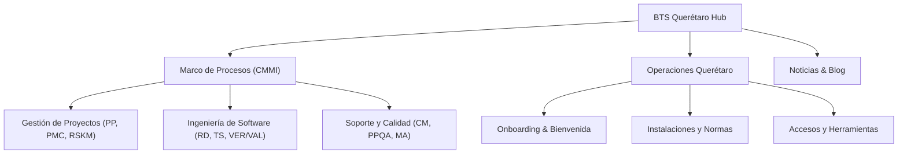

# Centro de Documentación y Procesos BTS Querétaro

Bienvenido al repositorio centralizado de documentación y buenas prácticas de la **Oficina de Querétaro**. Este espacio tiene como objetivo consolidar en una única fuente de verdad la forma en que trabajamos, gestionamos proyectos, aseguramos la calidad y colaboramos día a día.

:::tip ¿Por qué una base de conocimiento centralizada?
Facilita la incorporación (*onboarding*) de nuevos miembros del equipo, estandariza criterios técnicos y de gestión, y nos ayuda a mantener un nivel de madurez predecible y medible según estándares de la industria como **CMMI**.
:::

---

## 🏛️ Estructura del Portal

Este portal está dividido en tres pilares principales:

### 1. [Marco de Procesos CMMI](./cmmi/introduccion.md)
Documentación formal de los procesos clave de ciclo de vida de desarrollo de software y gestión:
- **Gestión de Proyectos**: Planificación, estimación, seguimiento de hitos y control de riesgos.
- **Ingeniería de Software**: Levantamiento de requerimientos, diseño, estándares de código, Pull Requests y pruebas QA.
- **Soporte y Calidad**: Gestión de configuración (Git/Release), auditoría de procesos y métricas operativas.
- **[Plantilla Estándar](./cmmi/plantilla-proceso.md)**: Formato para redactar o actualizar cualquier proceso nuevo.

### 2. [Oficina Querétaro](./oficina-qro/onboarding.md)
Información práctica sobre la operación local:
- Protocolo de bienvenida para nuevos colaboradores.
- Normativas de uso de instalaciones, salas de juntas y estaciones de trabajo.
- Directorio de herramientas, VPNs y cuentas requeridas.

### 3. [Noticias & Blog](/blog)
Publicaciones sobre retrospectivas, lanzamientos de proyectos, anuncios internos y eventos de la oficina de Querétaro.

---

## 🚀 ¿Cómo contribuir o actualizar un proceso?

La documentación vive como código (*Docs as Code*) en este repositorio. Cualquier integrante del equipo puede sugerir cambios o añadir nueva información:

1. Crea una rama (`feature/mejora-proceso-xyz`).
2. Edita o añade los archivos Markdown en la carpeta `docs/`.
3. Valida localmente con `npm start`.
4. Abre un Pull Request para revisión del equipo o del líder de calidad/oficina.
