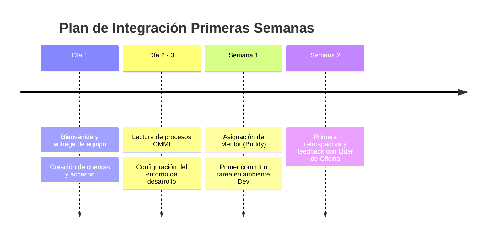

# Guía de Onboarding para Nuevos Colaboradores

¡Bienvenido(a) al equipo de BTS Querétaro! Esta guía te orientará en tus primeros pasos para configurar tu equipo, conocer al grupo y comenzar a aportar de manera fluida.

---

## 🗓️ Hoja de Ruta de los Primeros Días

---

## 📋 Checklist de Primeros Pasos

### 1. Cuentas y Accesos
- [ ] Correo corporativo configurado y autenticación multifactor (MFA).
- [ ] Ingreso al canal de Slack / Teams de la oficina (`#qro-general`, `#qro-devs`).
- [ ] Invitación a la organización de GitHub / GitLab.
- [ ] Acceso a tableros en Jira y documentación en Confluence.

### 2. Entorno Local de Trabajo
- [ ] Instalación de herramientas estándar (Git, Node.js, Docker, IDE preferido).
- [ ] Configuración de llaves SSH y firmas GPG para commits.
- [ ] Clonar y levantar el proyecto asignado siguiendo su respectivo `README.md`.

### 3. Cultura y Procesos
- [ ] Leer la [Introducción a CMMI](../cmmi/introduccion.md).
- [ ] Conocer las políticas de [Instalaciones y Convivencia](./instalaciones.md).
- [ ] Presentarte con el equipo en la reunión de integración semanal.
