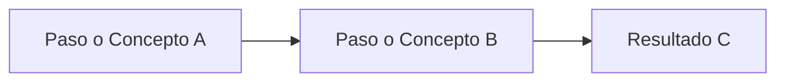

# Plantilla Estándar para la Creación de Guías

Esta plantilla define la **estructura mínima obligatoria** que debe tener cualquier guía práctica o metodológica en el portal de BTS Querétaro. Su propósito es garantizar coherencia, legibilidad y trazabilidad técnica en todos los activos documentales.

:::info ¿Cómo usar esta plantilla?
1. Crea un nuevo archivo en `docs/guias/gXX-nombre-de-la-guia.md`.
2. Copia el bloque de código Markdown que se encuentra a continuación.
3. Completa cada sección siguiendo las indicaciones entre corchetes `[...]`.
4. Crea su traducción correspondiente en `i18n/en/docusaurus-plugin-content-docs/current/guias/`.
:::

---

## 📄 Formato Base en Markdown

Copia y pega la siguiente estructura al redactar una nueva guía:

````markdown
---
sidebar_position: [Número de orden en el menú]
title: "[GXX] - [Título de la Guía]"
description: "[Descripción breve de 1 o 2 oraciones para vista previa y SEO]"
tags:
  - guías
  - [palabra-clave-1]
  - [palabra-clave-2]
---

# [GXX] - Guía de [Nombre del Tema]

[Párrafo introductorio explicando brevemente qué es esta guía, a quién va dirigida y cuál es su beneficio principal.]

---

## 🎯 1. Objetivos de la Guía

- [Objetivo 1: Qué aprenderá o logrará el lector al aplicar la guía].
- [Objetivo 2: Criterio de estandarización o beneficio esperado].
- [Objetivo 3: Impacto en calidad, tiempo o gestión de equipo].

## 📋 2. Prerrequisitos y Alcance

- **Prerrequisitos**: [Herramientas necesarias, accesos previos o conocimientos requeridos].
- **Alcance**: [A qué proyectos, roles o escenarios aplica y cuáles quedan expresamente excluidos].

---

## 💡 3. Marco Conceptual / Fundamentos

[Explicación de los principios teóricos o metodológicos detrás del tema. Se recomienda incluir diagramas visuales en Mermaid cuando sea relevante.]



---

## 🚀 4. Procedimiento / Pasos Prácticos

### Paso 1: [Nombre del Paso]
- **Descripción**: [Detalle de qué hacer y cómo hacerlo].
- **Herramienta / Entorno**: [Jira, GitHub, IDE, Consola, etc.].

### Paso 2: [Nombre del Paso]
- **Descripción**: [Detalle de la acción].

### Paso 3: [Nombre del Paso]
- **Descripción**: [Detalle de la acción].

---

## ⚖️ 5. Ejemplos Prácticos (Antes vs. Después)

### Caso / Ejemplo 1: [Escenario]
- ❌ **Práctica incorrecta o débil**: [Explicación del error común].
- ✅ **Práctica recomendada (Estándar)**: [Ejemplo de cómo debe realizarse correctamente].

---

## ⚠️ 6. Errores Frecuentes y Buenas Prácticas

| Error Frecuente | Por qué ocurre | Cómo prevenirlo / solucionarlo |
|---|---|---|
| [Error 1] | [Causa] | [Recomendación] |
| [Error 2] | [Causa] | [Recomendación] |

---

## 📦 7. Salidas y Entregables

Al completar satisfactoriamente esta guía, se obtienen los siguientes artefactos verificables:
- [Artefacto 1: Ej. Documento redactado, Pull Request aprobado, objetivo validado].
- [Artefacto 2: Registro en Jira / acta de reunión / evidencia de prueba].

---

## 📚 8. Referencias y Lecturas Complementarias

- 📖 **[Título del Libro / Artículo](https://ejemplo.com)** — *Autor (Año, Editorial)*. [Breve descripción de su relevancia].
- 🌐 **[Documentación Oficial / Estándar](https://ejemplo.com)** — [Descripción].

---

## 👥 9. Control del Documento

### Metadatos del Activo

| Campo | Detalle |
|---|---|
| **Código** | G[XX]-[NOMBRE-CORTO] |
| **Versión** | 1.0 |
| **Área CMMI / Modelo** | [Ej: PP, PMC, TS, VER, CAR, u Operaciones Generales] |
| **Responsable / Owner** | [Rol o Equipo responsable del mantenimiento de la guía] |
| **Última Revisión** | AAAA-MM-DD |

### Autores y Revisores
- **Autor(es)**: [Nombre y rol de quienes redactaron la guía].
- **Revisor(es) / Aprobador(es)**: [Nombre y rol de los líderes técnicos o de calidad que validaron].

### Bitácora de Versiones

| Versión | Fecha | Autor | Cambios Principales |
|:---:|:---:|---|---|
| **1.0** | AAAA-MM-DD | [Nombre] | Creación y publicación de la versión inicial de la guía. |
````

