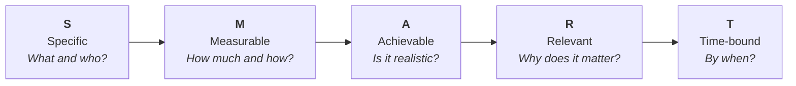

# G01 - Guide for Defining SMART Goals

This guide assists team members in properly formulating individual, project, and departmental goals using the **SMART** methodology to ensure clarity, alignment, and tangible results.

---

## 🎯 Guide Objectives

- Guide team members in formulating effective and actionable goals.
- Provide a common evaluation framework to verify whether a goal is properly framed.
- Facilitate goal tracking in projects, continuous improvement plans (CMMI), and performance evaluations.

## 📋 Prerequisites

- Identify a business, technical, or process need that requires addressing.
- Understand the context of the project or office department where the goal will impact.

---

## 💡 What is a SMART Goal?

The concept was introduced in 1981 by George T. Doran in his paper *"There’s a S.M.A.R.T. way to write management’s goals and objectives"*. Its purpose is to replace vague or subjective ambitions with clear and verifiable statements.



A **SMART** goal meets five essential attributes:

1. **S - Specific**: Clear, detailed, and unambiguous.
2. **M - Measurable**: Backed by quantifiable numbers or metrics.
3. **A - Achievable**: Challenging yet realistic given available resources and skills.
4. **R - Relevant**: Aligned with strategic priorities of the project or office.
5. **T - Time-bound**: Set with an explicit deadline or target timeframe.

---

## 🔍 Detailed Breakdown of the 5 SMART Criteria

### 1. Specific
A goal should never leave room for subjective interpretation. To ensure specificity, answer:
- **What exactly do we want to accomplish?** Concrete action and desired outcome.
- **Who is involved?** Responsible roles, teams, or collaborators.
- **Where or in what scope?** Affected module, project, process, or domain.

:::tip Specificity Rule of Thumb
If two people read the goal and picture different outcomes, the goal is **not** specific enough.
:::

---

### 2. Measurable
If it cannot be measured, progress cannot be managed or evaluated. Tangible numerical evidence or a clear binary verification must exist. Answer:
- **What is the baseline metric and what is the target?** (e.g., from 60% to 85%).
- **Through what tool or data source will it be verified?** (Jira reports, SonarQube metrics, Google Analytics, logged hours).
- **How will we objectively confirm that the goal was accomplished?**

---

### 3. Achievable
Setting impossible goals creates frustration and team demotivation. Conversely, overly easy goals fail to inspire growth. Answer:
- **Do we have the required knowledge, tools, team capacity, and time?**
- **Have we identified potential blockers or dependencies that could delay progress?**
- **Is the estimated effort balanced alongside regular operational duties?**

---

### 4. Relevant
The goal must produce a tangible impact on the mission of the team or organization. Avoid "busy work". Answer:
- **Why is it worthwhile to invest effort into this right now?**
- **Does it contribute to the strategic goals of the office, the client, or CMMI?**
- **Does it solve a genuine problem or provide noticeable value?**

---

### 5. Time-bound
A goal without a target date often becomes a perpetual intention prone to procrastination. Answer:
- **What is the exact deadline?** (Day/Month/Year or end of a specific Quarter/Sprint).
- **Are there intermediate milestones to track progress before the final date?**

---

## 📐 Practical Formula for Drafting a SMART Goal

To make drafting straightforward, use this syntactic pattern:

:::info General Formula Pattern
**Action verb in infinitive** + **Change metric (from X to Y)** + **Context / Strategy** + **Deadline**
:::

```text
[Action verb in infinitive]
  + [What will be measured and the numeric target (from X to Y)]
  + [Through what strategy, tool, or scope]
  + [By what target date or timeframe]
```

---

## ⚖️ Practical Examples: Before vs. After

### Example 1: Software Quality & Engineering
* ❌ **Poorly defined (Vague)**: *"Improve delivery quality and reduce errors in the project."*
* ✅ **SMART**: *"Reduce QA-reported defects by 30% (from an average of 10 to fewer than 7 bugs per sprint) in the payment processing module by adopting mandatory code reviews and unit testing with at least 75% coverage, before November 30, 2026."*

### Example 2: CMMI Process Management
* ❌ **Poorly defined (Vague)**: *"Document office processes."*
* ✅ **SMART**: *"Standardize and publish 100% of the 5 core engineering processes on the documentation portal using the CMMI template by the end of Q4 2026."*

### Example 3: Office Operations & Onboarding
* ❌ **Poorly defined (Vague)**: *"Make onboarding faster."*
* ✅ **SMART**: *"Decrease developer technical integration time (time-to-first-commit) from 8 business days to 3 business days by December 15, 2026, by implementing an automated checklist and the local welcome guide."*

---

## ⚠️ Common Mistakes when Formulating Goals

| Common Mistake | Why it happens | How to fix it |
|---|---|---|
| **Confusing goals with tasks** | Writing an activity instead of its outcome (e.g., *"Install SonarQube"*). | Focus on the result (e.g., *"Achieve >= 80% test coverage using SonarQube"*). |
| **Missing baseline** | Saying *"increase"* without knowing current numbers. | Measure the baseline status before fixing target figures. |
| **Vague timeframes** | Using phrases like *"as soon as possible"* or *"in coming months"*. | Specify concrete dates (e.g., *"by December 15"*). |
| **Vanity metrics** | Measuring metrics that don't drive real impact. | Ask *"If we hit this number, does the business or project genuinely improve?"*. |

---

## ✅ Self-Assessment Checklist

Before finalizing your goal, verify if it satisfies all points:

- [ ] Does the goal start with an action verb in the infinitive?
- [ ] Would any team member understand exactly what must be achieved without additional explanation?
- [ ] Does it include a verifiable number, percentage, or indicator?
- [ ] Is it feasible to accomplish with current resources without jeopardizing operations?
- [ ] Is it clear why this goal is a priority right now?
- [ ] Does it specify an explicit deadline?

---

## 👥 Document Control & History

### Original Authors (Taro IT)
- **María de los Ángeles Contreras Anaya**
- **Eduardo Andrés Castillo Perera**
- **Adolfo Acosta Castro**

### Adaptation & Continuous Improvement (BTS Querétaro)
- **José Carlos Pasillas**

### Version Log

| Version | Date | Key Changes |
|:---:|:---:|---|
| **3.0** | 2026-10 | Modernization for **BTS Querétaro**: drafting formula, Before vs. After comparison table, self-assessment checklist, Mermaid diagrams, and bilingual i18n support. |
| **2.0** | - | Institutionalization of the asset as an official guide. |
| **1.1** | - | Refactoring from process format into a guide. |
| **1.0** | - | Initial creation of the goal definition process. |
