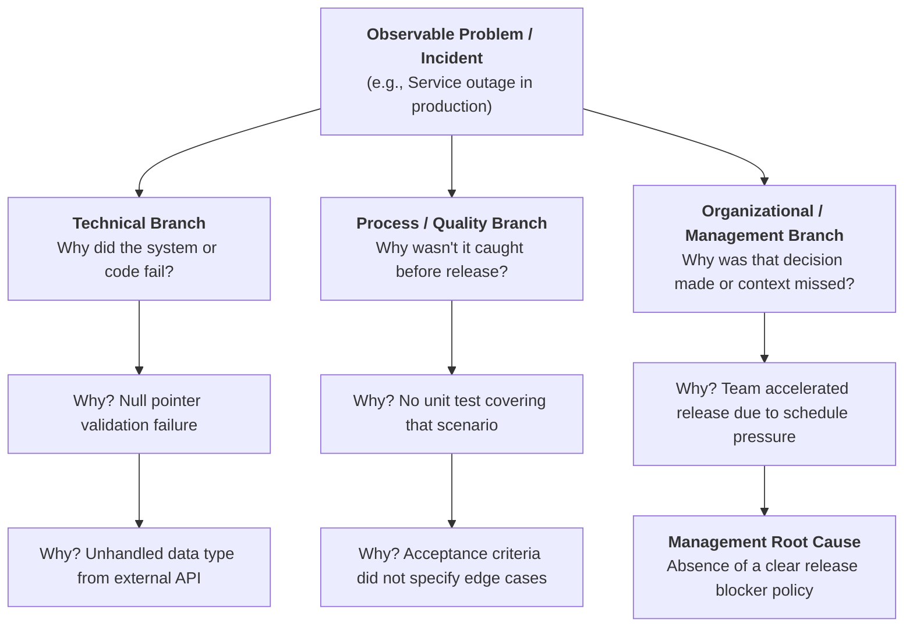
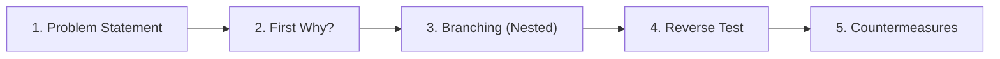

# G02 - Guide for Root Cause Analysis: The 5 Whys (Nested Whys)

This guide outlines our approach to investigating incidents, software defects, and operational deviations across the office, looking beyond surface symptoms through the **5 Whys** technique and its branched variant, **Nested Whys**.

---

## 🎯 Guide Objectives

- Provide a structured, blameless method for uncovering the root causes of failures and incidents.
- Distinguish between superficial fixes (immediate patches) and **systemic countermeasures** that prevent recurrence.
- Demonstrate how to apply the **Nested Whys** framework to complex problems involving interconnected technical, procedural, and management dimensions.

## 📋 Prerequisites

- A clearly identified problem or incident (e.g., production outage, schedule slip, broken CI/CD pipeline).
- Objective evidence regarding the occurrence (logs, Jira reports, metrics, recordings, or screenshots).

---

## 🏛️ Historical Origin: Sakichi Toyoda & The Toyota System

The **5 Whys** technique was originally developed in the 1930s by **Sakichi Toyoda** (industrial inventor and founder of Toyota Industries) and later formalized by **Taiichi Ohno** as a foundational pillar of the *Toyota Production System (TPS)* and Lean philosophy.

> *"The basis of Toyota's scientific approach is to ask 'why?' five times whenever we find a problem. By repeating why five times, the nature of the problem as well as its solution becomes clear."*  
> — **Taiichi Ohno**, *Toyota Production System: Beyond Large-Scale Production*

---

## 🌳 From Linear 5 Whys to "Nested Whys"

In modern software engineering and operations, problems rarely stem from a single linear sequence. Three interrelated dimensions typically interact:

A **Nested Whys** analysis opens distinct branches whenever an answer reveals multiple contributing causal factors.

---

## 🚀 Step-by-Step Methodology

### Step 1: Draft a Fact-Based Problem Statement
- Describe **what happened**, **when**, **where**, and its **quantifiable impact**.
- ❌ *Poor*: "Developers pushed buggy code."
- ✅ *Good*: "The authentication service rejected 40% of login requests for 35 minutes following the deployment of version 2.4.1."

### Step 2: Ask the First "Why?" Based on Concrete Evidence
- Every answer must be substantiated by observable facts (logs, metrics, code), never by guesswork or individual blame.

### Step 3: Drill Down and Branch (Nested Whys)
- If an answer involves both a technical flaw and a process omission, branch into separate lines of inquiry:
  - **Technical Dimension**: Why did the code/infrastructure allow the failure?
  - **Detection/Process Dimension**: Why did prior checkpoints (code review, automated tests, QA) fail to catch it?
  - **Decision/Training Dimension**: What training or guidelines were missing?

### Step 4: The Reverse Test (Sanity Check)
Validate the causal chain by reading it backwards using the word **"Therefore"**:
> *"There was no release blocker policy, **therefore** the deployment was rushed; because it was rushed, edge cases were omitted, **therefore** there was no null pointer unit test; because there was no test, the defect reached production."*  
> If the backwards reading makes rigorous logical sense, the causal chain is sound.

### Step 5: Design Systemic Countermeasures vs. Patches
- A **patch** addresses the immediate symptom (e.g., *"restart the server"* or *"fix the one line of code"*).
- A **countermeasure** alters the underlying system or workflow so the root cause cannot manifest again (e.g., *"add a linter rule enforcing null-safety in CI/CD and update the PR template"*).

---

## ⚖️ Practical Example: Failed Deployment

| Level | Question | Answer | Dimension |
|:---:|---|---|:---:|
| **1** | Why did user login fail? | Database connection pool was exhausted by open connections. | Technical |
| **2** | Why was the pool exhausted? | The newly deployed endpoint did not release connection pool handles after queries. | Technical |
| **3 (Branch A)** | Why didn't the endpoint release connections? | The developer was unfamiliar with the newly adopted ORM pool lifecycle. | Training |
| **3 (Branch B)** | Why wasn't the connection leak detected during QA? | Load testing is not routinely run on staging prior to release. | Process |
| **4** | Why isn't load testing run beforehand? | It is not automated as part of the release CI/CD pipeline for major versions. | Process |
| **5 (Root)** | Why isn't it standardized? | **Root Cause:** Absence of a formal production readiness standard (*Definition of Done* / CMMI VER). | Quality / Governance |

**Agreed Countermeasures:**
1. Fix connection leak in the ORM configuration immediately (*Immediate Patch*).
2. Integrate an automated load test suite into the pre-release pipeline (*Process Countermeasure*).
3. Update the *Definition of Done* across software engineering processes (*Governance Countermeasure*).

---

## ⚠️ Common Pitfalls to Avoid

1. **The "Human Error" Trap**: Concluding *"the engineer made a mistake"* halts investigation prematurely. The actual question is: *why did the system and processes allow a human mistake to reach production unnoticed?*
2. **Strictly Linear Thinking**: Real-world incidents almost always involve technical and organizational factors. Use branched trees (*nested whys*).
3. **Stopping at 3 Whys**: Quitting early results in temporary band-aids rather than permanent prevention.
4. **Punitive vs. Blameless Culture**: The goal is never to penalize individuals, but to bulletproof our collective processes and toolchains.

---

## 📚 Book References & Further Reading

To explore the foundations and deeper applications of this methodology:

- 📖 **[Toyota Production System: Beyond Large-Scale Production](https://www.goodreads.com/book/show/184411.Toyota_Production_System)** — *Taiichi Ohno (1988, Productivity Press)*. The seminal work formalizing the 5 Whys practice within Toyota's world-class manufacturing system.
- 📖 **[The Toyota Way: 14 Management Principles from the World's Greatest Manufacturer](https://www.goodreads.com/book/show/17643.The_Toyota_Way)** — *Jeffrey K. Liker (2004, McGraw-Hill)*. Details Principle 14 on becoming a learning organization through relentless reflection (*Hansei*) and continuous improvement (*Kaizen*).
- 📖 **[Toyota Kata: Managing People for Improvement, Adaptiveness and Superior Results](https://www.goodreads.com/book/show/6797747-toyota-kata)** — *Mike Rother (2009, McGraw-Hill)*. A practical guide on building the daily scientific problem-solving routine in modern teams.
- 🌐 **[Toyota Global: The Origin of 5 Whys](https://www.toyota-global.com/company/vision_philosophy/toyota_production_system/)** — Toyota's official portal covering the core pillars of the Toyota Production System.

---

## 👥 Document Control

| Field | Detail |
|---|---|
| **Code** | G02-CAUSA-RAIZ |
| **Version** | 1.0 |
| **Associated CMMI Area** | Causal Analysis and Resolution (CAR) & Verification (VER) |
| **Owner** | BTS Querétaro Engineering & Quality Team |
