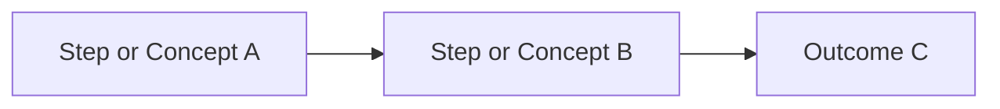

# Standard Template for Creating Guides

This template establishes the **mandatory minimum structure** that every practical or methodological guide must follow within the BTS Querétaro portal. Its goal is to maintain technical consistency, readability, and procedural traceability across all documentation assets.

:::info How to use this template?
1. Create a new file in `docs/guias/gXX-guide-name.md`.
2. Copy the Markdown template snippet below.
3. Fill out each section following the bracketed instructions `[...]`.
4. Provide the corresponding translation under `i18n/en/docusaurus-plugin-content-docs/current/guias/`.
:::

---

## 📄 Base Markdown Template

Copy and paste the following structure when authoring a new guide:

````markdown
---
sidebar_position: [Navigation order number]
title: "[GXX] - [Guide Title]"
description: "[Brief 1-2 sentence overview for previews and search]"
tags:
  - guides
  - [keyword-1]
  - [keyword-2]
---

# [GXX] - [Topic Name] Guide

[Introductory paragraph summarizing what this guide covers, target audience, and primary organizational benefits.]

---

## 🎯 1. Guide Objectives

- [Objective 1: What the reader will learn or achieve].
- [Objective 2: Standardization criterion or anticipated benefit].
- [Objective 3: Quality, velocity, or team impact].

## 📋 2. Prerequisites & Scope

- **Prerequisites**: [Required toolchains, preliminary credentials, or background knowledge].
- **Scope**: [Applicable projects, roles, or environments, alongside explicit exclusions].

---

## 💡 3. Conceptual Framework / Fundamentals

[Theoretical or methodological foundation behind the topic. Incorporating Mermaid visual diagrams is strongly encouraged where helpful.]



---

## 🚀 4. Procedure / Actionable Steps

### Step 1: [Step Name]
- **Description**: [Action details and execution steps].
- **Tool / Environment**: [Jira, GitHub, IDE, Terminal, etc.].

### Step 2: [Step Name]
- **Description**: [Action details].

### Step 3: [Step Name]
- **Description**: [Action details].

---

## ⚖️ 5. Practical Examples (Before vs. After)

### Scenario / Example 1: [Use Case]
- ❌ **Poor / Anti-pattern**: [Explanation of the common pitfall].
- ✅ **Recommended (Standard)**: [Concrete example of correct execution].

---

## ⚠️ 6. Common Pitfalls & Best Practices

| Common Pitfall | Why it happens | How to prevent / resolve |
|---|---|---|
| [Pitfall 1] | [Root cause] | [Actionable advice] |
| [Pitfall 2] | [Root cause] | [Actionable advice] |

---

## 📦 7. Outputs & Deliverables

Completing this guide produces the following verifiable deliverables:
- [Deliverable 1: e.g., Formulated goal, approved PR, document asset].
- [Deliverable 2: Jira record / meeting notes / test evidence].

---

## 📚 8. References & Further Reading

- 📖 **[Book / Article Title](https://example.com)** — *Author (Year, Publisher)*. [Context on relevance].
- 🌐 **[Official Documentation / Standard](https://example.com)** — [Context].

---

## 👥 9. Document Control

### Asset Metadata

| Field | Detail |
|---|---|
| **Code** | G[XX]-[SHORT-NAME] |
| **Version** | 1.0 |
| **CMMI Area / Model** | [e.g., PP, PMC, TS, VER, CAR, or General Operations] |
| **Owner** | [Role or team accountable for guide upkeep] |
| **Last Review** | YYYY-MM-DD |

### Authors & Reviewers
- **Author(s)**: [Name and title of guide authors].
- **Reviewer(s) / Approver(s)**: [Name and title of technical or quality leads].

### Version Log

| Version | Date | Author | Key Changes |
|:---:|:---:|---|---|
| **1.0** | YYYY-MM-DD | [Name] | Initial drafting and publication of the guide. |
````

